<h1>
  GIT 
</h1>

<h2>Найпопулярніші запитання та відповіді на співбесіді з GIT</h2>

<details>
<summary>1. Що таке Git і яка його роль у розробці програмного забезпечення?</summary>

#### GIT

- **Git** — розподілена система контролю версій (VCS) для відстеження змін у
  коді.

#### Використання:

- Зберігання історії змін у проєкті.

- Паралельна розробка в гілках (branches).

- Об’єднання змін через merge або rebase.

- Відновлення попередніх версій файлів.

- Спільна робота команд над кодом через сервіси (GitHub, GitLab, Bitbucket).

Git дозволяє безпечно керувати кодом, відстежувати зміни та ефективно
співпрацювати.

</details>

<details>
<summary>2. Чим Git відрізняється від інших систем контролю версій, наприклад, SVN або Mercurial?</summary>

#### GIT

- **Розподіленість:** у Git кожен клон репозиторію містить повну історію, на
  відміну від централізованих VCS (SVN).

- **Швидкість:** локальні операції (commit, diff, log) виконуються дуже швидко.

- **Гнучке керування гілками:** lightweight branches і швидке злиття
  (merge/rebase).

- **Зберігання змін:** Git зберігає снімки (snapshots) файлів, а не тільки
  дельти, як у SVN.

- **Широка інтеграція:** популярність Git забезпечує підтримку в CI/CD, GitHub,
  GitLab, IDE.

- **Безпека:** SHA-1 хешування гарантує цілісність історії.

Git ідеально підходить для сучасних командних workflow та open-source проєктів
завдяки швидкості, гнучкості та надійності.

</details>

<details>
<summary>3. У чому відмінність між Git і GitHub?</summary>

#### GIT

- **Git** — система контролю версій (VCS) для відстеження змін у коді локально
  або на будь-якому сервері.

- **GitHub** — онлайн-сервіс для зберігання Git-репозиторіїв з веб-інтерфейсом,
  спільною роботою та додатковими функціями: pull requests, issues, CI/CD
  інтеграції.

- Коротко: Git — інструмент для роботи з версіями коду, GitHub — платформа для
  хостингу та командної роботи з Git.

Можна використовувати Git без GitHub (локально) або GitHub безпосередньо для
колаборації через веб.

</details>

<details>
<summary>4. Що таке репозиторій у Git і яка його роль?</summary>

#### GIT

- **Репозиторій (repository, repo)** — це місце зберігання всього коду проєкту
  та історії змін.

- Містить:

  - Файли проєкту (код, документацію, конфігурації).

  - Історію комітів (зміни з авторами та повідомленнями).

  - Гілки (branches) для паралельної розробки.

- Може бути локальний (на вашому комп’ютері) або віддалений (GitHub, GitLab,
  Bitbucket).

Репозиторій дозволяє відстежувати зміни, працювати командою та повертатися до
попередніх версій коду.

</details>

<details>
<summary>5. Що таке коміт (commit) у Git і для чого він використовується?</summary>

#### GIT

- **Коміт (commit)** — це збереження знімка змін у репозиторії разом із
  повідомленням.

- Містить:

  - Історію змін файлів (added, modified, deleted).

  - Авторство та дату зміни.

  - Унікальний SHA-1 хеш для ідентифікації.

- Використовується для:

  - Відстеження прогресу проєкту.

  - Повернення до попередніх станів (git checkout, git revert).

  - Координації роботи в команді через pull/merge.

#### Приклад коміту:

```bash
git add index.html

git commit -m "feat(html): Додаю базову структуру сторінки"
```

Коміти формують історію проєкту, яку можна аналізувати, відновлювати і
об’єднувати.

</details>

<details>
<summary>6. Яка різниця між робочим каталогом (working directory), стейджингом (staging area/index) і репозиторієм (repository) у Git?</summary>

#### GIT

1. **Робочий каталог (Working Directory)**

- Це ваші файли на диску, які ви редагуєте.

- Містить останню версію коду з Git + незбережені зміни.

2. **Проміжна область (Staging Area / Index)**

- Тимчасове місце для підготовки змін до коміту.

- Ви обираєте, які файли/зміни будуть включені у наступний коміт.

- Команди: git add `<file>` додає зміни до стейджу.

3. **Локальний репозиторій (Repository)**

- Збережена історія комітів у .git папці.

- Містить всі коміти, гілки, теги, SHA-1 хеші.

- Команди: git commit переносить зміни зі стейджу у репозиторій.

#### Схематично:

```rust
Working Directory -> git add -> Staging Area -> git commit -> Repository
```

Ця модель дозволяє гнучко контролювати, які зміни зберігати, і робити чисту
історію комітів.

</details>

<details>
<summary>7. Що таке розгалуження (branching) у Git і чому воно важливе?</summary>

#### GIT

- **Розгалуження (branch)** — це окрема лінія розробки в репозиторії, яка
  дозволяє працювати над новими функціями, виправленнями або експериментами, не
  зачіпаючи основну гілку (main/master).

- Важливість:

  - Паралельна робота кількох розробників.

  - Безпечне тестування нових фіч.

  - Легка інтеграція через merge або rebase.

  - Чистіша історія комітів і контроль над змінами.

#### Приклад створення і перемикання гілки:

```bash
git branch feature-login

git checkout feature-login
```

Branching — основа сучасних workflow (Git Flow, GitHub Flow) для командної
розробки.

</details>

<details>
<summary>8. Що таке HEAD у Git і яка його роль?</summary>

#### GIT

- **HEAD** — це поточний вказівник на коміт, з яким ви зараз працюєте.

- Зазвичай HEAD показує на гілку, а гілка — на останній коміт.

- Використовується для:

  - Відстеження, де ви зараз перебуваєте в історії комітів.

  - Перемикання гілок (git checkout `<branch>`) або комітів (git checkout
    `<commit>`).

- Можливі стани HEAD:

  - **Normal** — вказує на гілку.

  - **Detached HEAD** — тимчасово вказує на конкретний коміт, не на гілку.

#### Приклад:

```bash
git checkout feature-login

# HEAD тепер вказує на гілку feature-login
```

HEAD — ключовий концепт для навігації по історії Git і управління комітами.

</details>

<details>
<summary>9. Що таке операція clone у Git і для чого вона використовується?</summary>

#### GIT

- `git clone` — створює повну копію віддаленого репозиторію на вашому локальному
  комп’ютері.

- **_Копія містить:_**

  - Усі файли проєкту.

  - Історію комітів.

  - Всі гілки та теги.

- **_Використовується для:_**

  - Початку роботи над існуючим проєктом.

  - Спільної роботи команди через GitHub, GitLab або інші сервери.

#### Приклад:

```bash
git clone https://github.com/user/repo.git
```

Результат: локальний репозиторій, готовий для комітів, гілок і синхронізації з
віддаленим сервером.

</details>

<details>
<summary>10. Як Git зберігає дані про проєкт і його історію змін?</summary>

#### GIT

- Git зберігає снімки (snapshots), а не просто дельти файлів.

- **Кожен коміт — це SHA-1 хеш з:**

  - Посиланням на попередній коміт.

  - Змінами файлів (знімком дерева).

  - Автором і повідомленням коміту.

- **Структура зберігання:**

  - `Blob` — вміст файлів.

  - `Tree` — каталог файлів та папок.

  - `Commit` — вказує на tree і попередній коміт.

- Папка `.git` містить всі об’єкти і метадані, що дозволяє повністю відтворити
  історію проєкту.

👉 Така модель робить Git швидким, надійним і дозволяє ефективно працювати з
гілками та злиттями.

</details>

<details>
<summary>11. Як ініціалізувати новий репозиторій Git?</summary>

#### GIT

- Використати команду:

```bash
git init
```

- Вона створює приховану папку .git у поточному каталозі, де зберігатиметься
  історія комітів, гілки та конфігурація.

- Далі треба додати файли й зробити перший коміт:

```bash
git add .

git commit -m "Initial commit"
```

Після git init каталог стає повноцінним Git-репозиторієм.

</details>

<details>
<summary>12. Для чого використовується команда git status?</summary>

#### GIT

- Показує поточний стан робочого каталогу та індексу (staging area).

- Інформує про:

  - Які файли змінені, але ще не додані.

  - Які файли вже в індексі та підуть у наступний коміт.

  - Які файли не відслідковуються.

  - Поточну гілку та її відставання/випередження відносно remote.

#### Приклад:

```bash
git status
```

Дає зрозуміти, що саме буде закомічено, а що ще потребує git add.

</details>

<details>
<summary>13. Яке призначення команди git add?</summary>

#### GIT

- `git add` додає зміни з робочого каталогу у staging area (індекс).

- Це підготовчий етап перед комітом.

- Можна додавати окремі файли або всі зміни.

#### Приклади:

```bash
git add file.txt     # додає конкретний файл
git add .            # додає всі зміни в поточному каталозі
git add -p           # додає зміни частинами (interactive)
```

Сам `git add` ще не зберігає зміни в історії — тільки позначає їх для наступного
`git commit`.

</details>

<details>
<summary>14. Яким чином створюється новий коміт у Git?</summary>

#### GIT

1. Спочатку додати зміни у staging area:

```bash
git add .
```

2. Потім створити коміт:

```bash
git commit -m "Опис змін"
```

- Ключ -m додає повідомлення коміту.

- Якщо його не вказати — відкриється редактор для введення повідомлення.

- Коміт зберігає знімок (snapshot) поточного стану індексу в історії
  репозиторію.

Рекомендується писати короткі й зрозумілі повідомлення, щоб легко відстежувати
зміни.

</details>

<details>
<summary>15. Які дані зберігає об’єкт коміту в Git?</summary>

#### GIT

- Об’єкт коміту містить:

  - Хеш (SHA-1/SHA-256) — унікальний ідентифікатор.

  - Посилання на tree-об’єкт (структура файлів і папок на момент коміту).

  - Посилання на parent-коміти (зв’язок в історії, може бути кілька у merge).

  - Автор (ім’я, email, час створення).

  - Комітер (той, хто зафіксував, може відрізнятися від автора).

  - Commit message (опис змін).

Таким чином Git зберігає не файли, а знімки стану + метадані, що дозволяє легко
відновлювати і порівнювати історію.

</details>

<details>
<summary>16. Яка різниця між командами git push і git fetch?</summary>

#### GIT

- `git push` — відправляє локальні коміти у віддалений репозиторій (оновлює
  remote-branch).

- `git fetch` — отримує нові дані з віддаленого репозиторію, але не зливає їх у
  локальну гілку (оновлює тільки refs/remotes).

#### Тобто:

- `push` = викласти свої зміни.

- `fetch` = завантажити чужі зміни для перегляду/злиття.

</details>

<details>
<summary>17. Яке призначення команди git pull?</summary>

#### GIT

- `git pull` = `git fetch` + `git merge` (або `rebase`, якщо вказано опцію).

- Вона завантажує останні зміни з віддаленого репозиторію і одразу інтегрує їх у
  поточну гілку.

- Використовується для синхронізації локальної гілки з remote.

#### Приклад:

```bash
git pull origin main
```

- Отримає оновлення з origin/main і зіллє їх у вашу локальну main.

Якщо потрібен лише перегляд змін без злиття — краще використовувати git fetch.

</details>

<details>
<summary>18. Яке призначення та варіанти використання команди git branch?</summary>

#### GIT

- `git branch` керує гілками в репозиторії. Основні сценарії:

1. Перегляд усіх гілок:

```bash
git branch
```

2. Створення нової гілки:

```bash
git branch feature/login
```

3. Видалення гілки (локально):

```bash
git branch -d feature/login # безпечне (якщо змерджено) git branch -D
feature/login # примусове
```

4. Перейменування гілки:

```bash
git branch -m old-name new-name
```

5. Перегляд віддалених гілок:

```bash
git branch -r
```

Важливо: `git branch` не перемикає гілки, а тільки створює/керує. Для
перемикання використовується `git checkout` або `git switch`.

</details>

<details>
<summary>19. Як використовувати git checkout для перемикання між гілками?</summary>

#### GIT

- Команда `git checkout <branch>` змінює поточну гілку на вказану, оновлюючи
  робочий каталог до стану цієї гілки.

#### Приклад:

```bash
git checkout feature/login
```

- Тепер HEAD вказує на feature/login, і всі файли відображають її стан.

**Створення нової гілки та одночасне перемикання:**

```bash
git checkout -b feature/signup
```

- Перевага: швидко працювати з різними гілками без втрати змін (якщо вони
  закомічені або у стейджі).

В сучасних workflow рекомендують `git switch` для перемикання гілок
(`git switch feature/login`) — більш інтуїтивно.

</details>

<details>
<summary>20. Для чого використовується команда git merge?</summary>

#### GIT

- `git merge <branch>` об’єднує зміни з іншої гілки у поточну.

- Застосовується для інтеграції роботи над фічами або виправленнями в основну
  гілку (main/develop).

#### Типи злиття:

- `Fast-forward` — просто переміщує вказівник гілки, якщо історія лінійна.

- `Three-way merge` — створює новий коміт злиття, якщо гілки розходяться.

#### Приклад:

```bash
git checkout main git merge feature/login
```

- Після цього всі зміни з feature/login будуть в main.

Merge дозволяє безпечно інтегрувати паралельні гілки без втрати історії.

</details>

<details>
<summary>21. Який Git workflow ви зазвичай використовуєте в роботі?</summary>

#### GIT

- Найчастіше використовую Git Flow / Feature Branch Workflow:

  - `main` — завжди стабільна продакшн-версія.

  - `develop` — інтеграційна гілка для нових фіч.

  - для задач створюю окрему `feature`.

  - після завершення — `pull request` → `code review` → `merge у develop`.

  - перед релізом створюється `release`, після тестів — `merge у main` + тег.

  - багфікси йдуть у `hotfix` від main.

Цей процес дисциплінує, дає прозорість і контроль над релізами.

</details>

<details>
<summary>22. Опишіть кроки створення нової гілки та її злиття в main.</summary>

#### GIT

1. Переконуюсь, що локальний main оновлений:

```bash
git checkout main
git pull origin main
```

2. Створюю нову гілку від main:

```bash
git checkout -b feature/my-task
```

3. Працюю, комічу зміни:

```bash
git add .
git commit -m "Implement feature X"
```

4. Пушу гілку на remote:

```bash
git push origin feature/my-task
```

5. Відкриваю Pull Request → проходить code review → CI.

6. Мерджу в main (звичайно через squash або rebase, щоб історія була чистою).

7. Видаляю feature-гілку локально і на remote.

</details>

<details>
<summary>23. Що таке merge conflict у Git і як його вирішують?</summary>

#### GIT

- Merge conflict виникає, коли дві гілки змінюють один і той самий рядок коду
  або файл у несумісний спосіб, і Git не може автоматично об’єднати зміни.

#### Рішення:

1. Виконати merge/rebase → Git покаже конфліктні файли.

2. Відкрити файл, знайти маркери <<<<<<<, =======, >>>>>>>.

3. Вибрати або об’єднати потрібні зміни вручну.

4. Позначити файл як вирішений:

```bash
git add <file>
```

5. Завершити merge/rebase комітом:

```bash
git commit
```

</details>

<details>
<summary>24. Що таке fast-forward merge у Git?</summary>

#### GIT

- Fast-forward merge — це злиття, коли гілка-ціль (наприклад main) не має нових
  комітів після відгалуження feature-гілки. Тоді Git просто пересуває вказівник
  main на останній коміт feature-гілки без створення додаткового merge-коміту.

#### Приклад:

```bash
git checkout main
git merge feature/my-task --ff
```

Це "чисте" злиття без зайвих комітів.

</details>

<details>
<summary>25. Що таке three-way merge у Git?</summary>

#### GIT

- Three-way merge — це злиття, коли Git використовує три точки для об’єднання:

1. `common ancestor` (базовий коміт, від якого розійшлися гілки),

2. `HEAD` (останній коміт у цільовій гілці, наприклад main),

3. `branch tip` (останній коміт у зливаній гілці, наприклад feature).

Git порівнює зміни відносно спільного предка й створює новий merge-коміт, що має
двох батьків.

Цей підхід застосовується, коли fast-forward неможливий (тобто в обох гілках є
нові коміти).

</details>

<details>
<summary>26. Які кроки виконати, щоб перебазувати (rebase) гілку в Git?</summary>

#### GIT

1. Перейти в свою гілку:

```bash
git checkout feature/my-task
```

2. Виконати rebase на актуальну main:

```bash
git fetch origin git rebase origin/main
```

3. Якщо є конфлікти — вирішити їх, додати файли:

```bash
git add <file> git rebase --continue
```

4. Коли все готово — оновити remote (з форсом, бо історія переписана):

```bash
git push origin feature/my-task --force
```

Rebase робить історію лінійною, на відміну від merge.

</details>

<details>
<summary>27. Які плюси й мінуси rebase у порівнянні з merge?</summary>

#### GIT

✅ **Переваги rebase**

- Лінійна, чиста історія без merge-комітів.

- Зручніше читати git log, легше дебажити.

- Кожен коміт виглядає так, ніби зроблений поверх останнього main.

❌ **Недоліки rebase**

- Переписує історію (особливо небезпечно для спільних гілок).

- Потрібен --force push, що може зламати історію іншим.

- Вимагає більшої дисципліни в команді.

✅ **Переваги merge**

- Зберігає повну історію розробки, без переписування.

- Безпечний для командної роботи.

- Простий у використанні.

❌ **Недоліки merge**

- Брудніший git log з великою кількістю merge-комітів.

- Історію важче аналізувати.

Загалом: merge — безпечніше для команд, rebase — краще для чистої історії.

</details>

<details>
<summary>28. Для чого використовуються теги в Git?</summary>

#### GIT

- Теги в Git — це фіксовані маркери на певні коміти, зазвичай для позначення
  релізів (v1.0, v2.1).

  - `Lightweight tag` — просто вказівка на коміт, без додаткової інформації.

  - `Annotated tag` — зберігає автора, дату, повідомлення і може бути підписаний
    GPG.

#### Теги зручні для:

- Відстеження версій у продакшн.

- Швидкого переходу на конкретний реліз:

```bash
git checkout v1.0
```

- CI/CD для автоматичного деплою.

</details>

<details>
<summary>29. Як скасувати коміт, який вже запушено на remote?</summary>

#### GIT

1. Якщо потрібно повністю видалити коміт (історія переписується, небезпечно для
   інших):

```bash
git reset --hard <коміт_до_потрібного>
git push origin <гілка> --force
```

2. Якщо потрібно зберегти історію, створивши "відкат" без перепису:

```bash
git revert <hash_коміту>
git push origin <гілка>
```

- `reset --hard` + `force push` змінює історію (небезпечно для спільних гілок).

- `revert` створює новий коміт, що відміняє зміни — безпечніше для команд.

</details>

<details>
<summary>30. Яке призначення головної гілки (main/master) у Git?</summary>

#### GIT

Головна гілка (main або раніше master) — це стабільна, завжди робоча версія
проєкту, на яку орієнтуються всі інші гілки.

- Від неї створюють feature-, release-, hotfix-гілки.

- Вона слугує базою для релізів.

- Зазвичай на ній запускається CI/CD і деплой в продакшн.

</details>

<details>
<summary>31. Що таке розподілена система контролю версій і як Git реалізує цей підхід?</summary>

#### GIT

- Розподілена система контролю версій (DVCS) — це система, де кожен розробник
  має повну копію репозиторію з історією комітів, а не лише робочі файли.

**Git функціонує як DVCS так:**

- Клонуючи репозиторій, отримуєш усю історію локально.

- Коміти, гілки, теги створюються локально й не потребують підключення до
  сервера.

- Синхронізація між розробниками відбувається через push/pull у віддалений
  репозиторій (наприклад, GitHub).

- Це дає швидкість, автономність і можливість працювати офлайн.

</details>

<details>
<summary>32. Що таке Git Feature Branch Workflow і як він працює?</summary>

#### GIT

- Feature Branch Workflow — підхід, коли для кожної нової задачі чи фічі
  створюється окрема гілка:

1. Від main або develop відгалужується feature/\*.

2. Розробка й коміти відбуваються тільки там.

3. Коли фіча готова → відкривається Pull Request.

4. Після code review і CI зміни вливаються назад у develop/main.

5. Feature-гілка видаляється.

Перевага: ізоляція змін, паралельна робота без конфліктів, чиста історія.

</details>

<details>
<summary>33. Що таке Gitflow Workflow і як він працює?</summary>

#### GIT

- **Gitflow** — це модель роботи з Git із чіткими правилами для різних типів
  гілок:

  - `main` → завжди стабільна продакшн-версія.

  - `develop` → інтеграційна гілка для активної розробки.

  - `feature/` → створюються від develop, після завершення зливаються назад у
    develop.

  - `release/` → відгалуження від develop для підготовки релізу, після тестів
    вливається в main і develop.

  - `hotfix/` → відгалуження від main для термінових виправлень, потім
    зливається і в main, і в develop.

✅ **Плюси:** чітка структура, контрольована розробка і релізи. ❌ **Мінуси:**
громіздкий процес для маленьких команд або continuous delivery.

</details>

<details>
<summary>34. Що таке Forking Workflow у Git і як він працює?</summary>

#### GIT

- **Forking Workflow** — це підхід, коли кожен розробник працює не з основним
  репозиторієм напряму, а зі своєю копією (fork).

#### Процес:

1. Розробник робить fork головного репозиторію у своєму GitHub/GitLab.

2. Клонує свій fork локально й створює гілку для змін.

3. Після завершення роботи пушить у свій fork.

4. Відкриває Pull Request з власного fork у головний репозиторій.

5. Після рев’ю та схвалення зміни зливаються в upstream.

Використовується у великих open-source проєктах, де стороннім контриб’юторам не
дають прямого доступу до основного репозиторію.

</details>

<details>
<summary>35. Що таке Centralized Workflow у Git і як він працює?</summary>

#### GIT

- **Centralized Workflow** — це модель, де є одна головна гілка (зазвичай main),
  і всі розробники працюють прямо в ній або створюють короткоживучі гілки тільки
  для малих задач.

#### Процес:

1. Усі клонують один remote-репозиторій.

2. Розробники роблять зміни й одразу пушать у main.

3. Якщо є конфлікти — вирішують перед пушем.

📌 Це схоже на старі централізовані системи (SVN), але з перевагами Git
(локальна історія, робота офлайн).

✅ Простий процес, мінімум гілок. ❌ Важко масштабувати в команді: часто
виникають конфлікти, немає ізоляції фіч.

</details>

<details>
<summary>36. Що таке remote repository у Git і для чого він потрібен?</summary>

#### GIT

- Віддалений репозиторій (remote) — це версія Git-репозиторію, що зберігається
  на сервері (GitHub, GitLab, Bitbucket).

#### Призначення:

- Спільна робота команди (push/pull змін).

- Централізоване зберігання коду та історії.

- Інтеграція з CI/CD.

#### Приклади команд:

```bash
git remote -v              # переглянути підключені remote
git remote add origin URL  # додати віддалений репозиторій
git push origin main       # відправити зміни
git pull origin main       # отримати зміни
```

</details>

<details>
<summary>37. ???</summary>

#### GIT

- Coming Soon... 😎

</details>

<details>
<summary>38. ???</summary>

#### GIT

- Coming Soon... 😎

</details>

<details>
<summary>39. ???</summary>

#### GIT

- Coming Soon... 😎

</details>

<details>
<summary>40. ???</summary>

#### GIT

- Coming Soon... 😎

</details>

<details>
<summary>41. ???</summary>

#### GIT

- Coming Soon... 😎

</details>

---

# GIT 

Вітаю! ✨ Цей репозиторій містить вичерпний конспект, який я створила під час
проходження курсу Нікіти Тимошенка про
[Git та GitHub](https://www.youtube.com/watch?v=9CnZihyYjjA&list=WL&index=2&t=1s)

📌 Конспект у форматі питання-відповіді, щоб ви могли перевірити себе та швидко
знаходити потрібну інформацію.

📌 Структура наближена до курсу, тож вам буде легко орієнтуватися в темах і
знаходити потрібний матеріал.

📌 Раджу пройти сам
[курс](https://www.youtube.com/watch?v=9CnZihyYjjA&list=WL&index=2&t=1s) та
прочитати
[конспект від Нікіти](https://github.com/NickTimosh/git_course/tree/main/notebooks)
адже там багато корисного:

- детальний опис команд,
- практичні завдання,
- корисні посилання.

✨ А цей конспект допоможе вам перевірити, наскільки добре ви засвоїли отримані
знання! 🚀

Якщо є якісь зауваження, або пропозиції для покращення не соромтесь створювати
issues або pull requests. Я відкрита до зворотного зв'язку 🙌

Легкого навчання!😊

---

<h2>Зміст</h2>

<details>
    <summary>Командний рядок</summary>
    <ul>
        <li><a href="#command-line-terms">Командний рядок — терміни</a></li>
        <li><a href="#files-system-terms">Файлова система — терміни</a></li>
        <li><a href="#path-to-files">Шлях до файлів</a></li>
        <li><a href="#read-folder-content">Читання вмісту папок(команди)</a></li>
        <li><a href="#interaction-with-folders">Взаємодія з папками(команди)</a></li>
        <li><a href="#interaction-with-files">Взаємодія з файлами(команди)</a></li>
    </ul>
</details>

<details>
  <summary>Git</summary>
  <ul>
    <li><a href="#git-overview">Короткий огляд</a></li>
    <li><a href="#git-config">Основні налаштування</a></li>
    <li><a href="#git-main-theory">Теорія, основні концепції</a></li>
    <li><a href="#git-main-commands">Основні команди</a></li>
    <li><a href="#git-extensions-basics">Розширення основ</a></li>
    <li><a href="#git-recovery-version">Вступ до відновлення версій</a></li>
    <li><a href="#git-branches">Вступ в git branch</a></li>
  </ul>
</details>

<details>
  <summary>GitHub</summary>
  <ul>
    <li><a href="#github-concept">Основні концепції</a></li>
    <li><a href="#github-first-repo">Перший репозиторій</a></li>
    <li><a href="#github-gitignore">Файл .gitignore</a></li>
    <li><a href="#github-watch-fork-stars">Watch, fork & stars</a></li>
    <li><a href="#github-fork">Копіювання репозиторію (Fork)</a></li>
    <li><a href="#github-pr">Створення Pull Requests (PR)</a></li>
    <li><a href="#github-issues">Створення Issues (задач)</a></li>
    <li><a href="#github-workflow">Огляд типового workflow</a></li>
    <li><a href="#github-ssh-key">SSH-ключ</a></li>
    <li><a href="#github-push-local-repo">Push локального репозиторію</a></li>
    <li><a href="#github-brach-and-pull">Гілки та pull request</a></li>
    <li><a href="#github-clone-repo">Клонування репозиторію</a></li>
  </ul>
</details>

---

<h2>Комадний рядок</h2>

[Конспект](https://github.com/NickTimosh/git_course/blob/main/notebooks/1.%20%D0%92%D1%81%D1%82%D1%83%D0%BF%20%D0%B2%20%D0%9A%D0%BE%D0%BC%D0%B0%D0%BD%D0%B4%D0%BD%D0%B8%D0%B9%20%D0%A0%D1%8F%D0%B4%D0%BE%D0%BA.md)

<h3 id="command-line-terms">Командний рядок — терміни</h3>

<details>
<summary>Що таке GUI?</summary>

- графічний інтерфейс користувача (Graphical User Interface)
  - спосіб взаємодії користувача з комп'ютером із використанням графічних
    елементів (вікна, кнопки і тд)

</details>

<details>
<summary>Що таке Сommand Line?</summary>

- командний рядок
  - текстовий інтерфейс для взаємодії з операційною системою
  - простір, де вводяться текстові команди
  - і тут же можуть викликатися і запускатися певні програми

</details>

<details>
<summary>Що таке термінал?</summary>

- програма або інструмент, який надає доступ до командного рядка (вікно, куди
  команди вводяться)

</details>

<details>
<summary>Що таке Shell?</summary>

- оболонка
  - програма, яка виконує команди, введені у терміналі (інтерпретатор команд)

</details>

<details>
<summary>Принцип роботи Shell (схема)</summary>

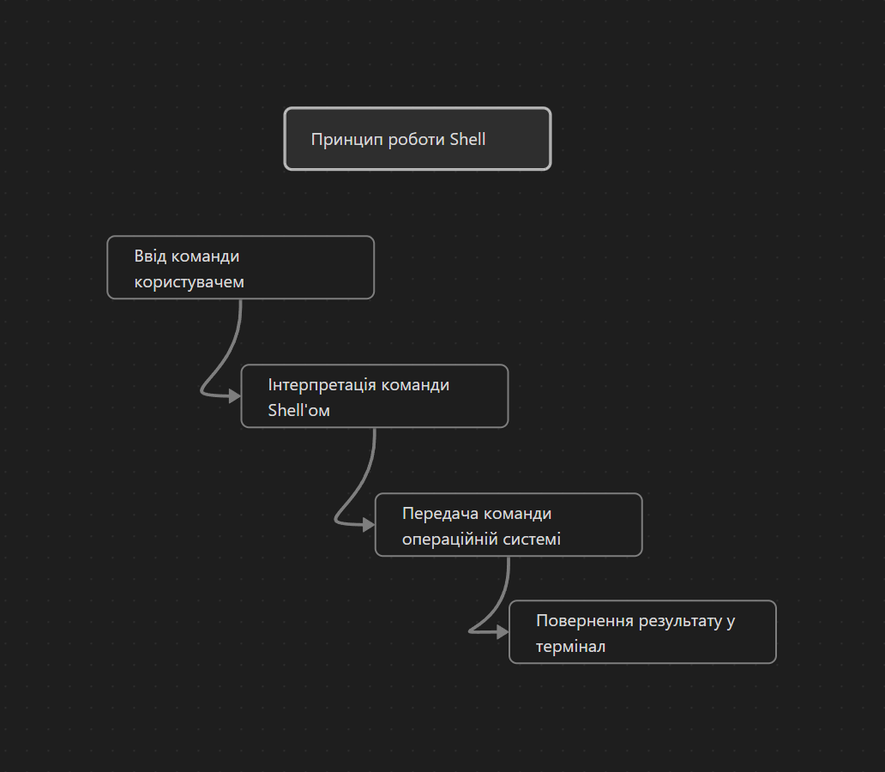

</details>

<details>
<summary>Що таке Bash?</summary>

- один із типів оболонок (Shell)
- Bourne Again Shell (Bash)
- підтримується у Windows через Git Bash

</details>

<details>
<summary>Взаємодія з ОС (схема)</summary>

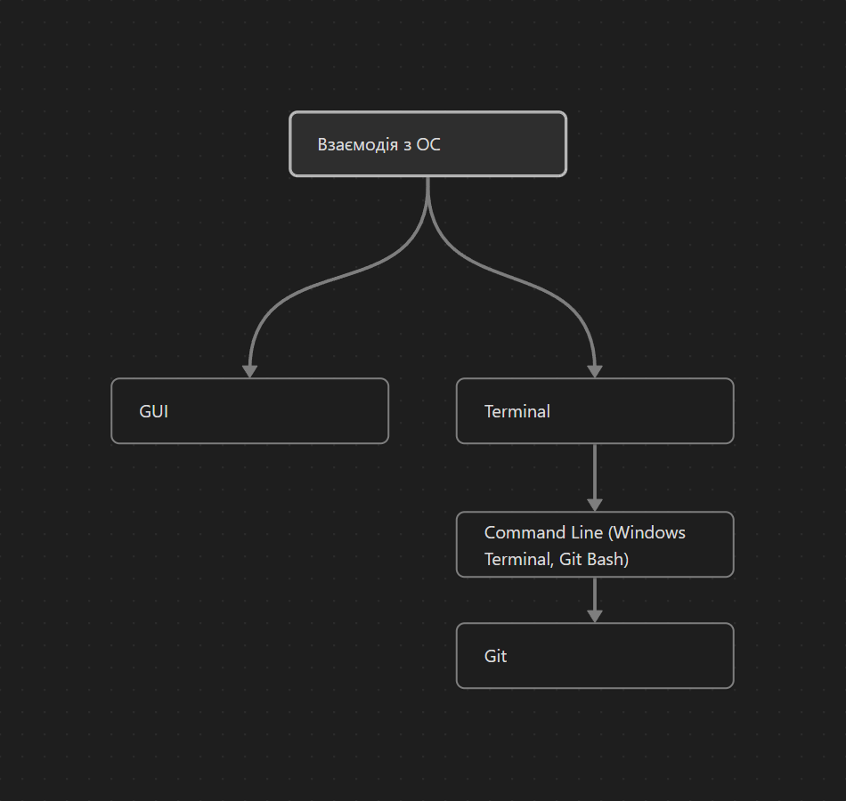

</details>

---

<h3 id="files-system-terms">Файлова система — терміни</h3>

<details>
<summary>Що таке каталог (директорія)?</summary>

- структура, яка використовується для організації файлів у файловій системі

</details>

<details>
<summary>Що таке поточний каталог?</summary>

- папка, в якій користувач перебуває прямо зараз
  - команди по замовчуванню виконуються у поточному каталозі

</details>

<details>
<summary>Що таке батьківський каталог?</summary>

- папка, що знаходиться на один рівень вища, за поточний

</details>

<details>
<summary>Що таке домашній каталог?</summary>

- персональний каталог користувача
  - Диск С —> Users —> User name (або USER)

</details>

<details>
<summary>Що таке кореневий каталог?</summary>

- початкова точка файлової системи
  - найвищий рівень ієрархії каталогів

</details>

<details>
<summary>Структура каталогів (схема)</summary>

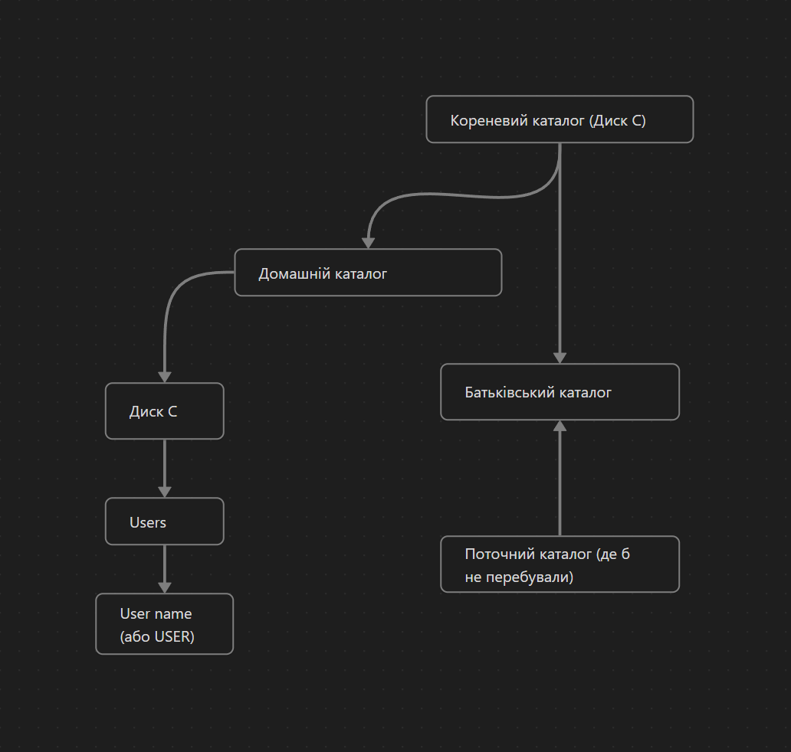

</details>

---

<h3 id="path-to-files">Шлях до файлів</h3>

<details>
<summary>Що таке шлях (path)?</summary>

- адреси файлів у каталозі файлової системи

</details>

<details>
<summary>Які є два види шляхів до файлів?</summary>

- абсолютний
- відносний

</details>

<details>
<summary>Де починається абсолютний шях?</summary>

- з кореневого каталогу

</details>

<details>
<summary>Що визначає відносний шях?</summary>

- розташування файлу по відношенню до поточного каталогу

</details>

<details>
<summary>Що таке розширення файлів?</summary>

- частина назви файлу, що йде після крапки

</details>

<details>
<summary>Для чого потрібне розширення файлів?</summary>

- для визначення типу файлу

</details>

---

<h3 id="read-folder-content">Командний рядок — читання вмісту папок (команди)</h3>

[Конспект](https://github.com/NickTimosh/git_course/blob/main/notebooks/2.%20git%20bash%20-%20%D0%BA%D0%BE%D0%BC%D0%B0%D0%BD%D0%B4%D0%B8.md)

[Практичні завдання](https://github.com/NickTimosh/git_course/blob/main/notebooks/3.%20git%20bash%20-%20%D0%BF%D1%80%D0%B0%D0%BA%D1%82%D0%B8%D0%BA%D0%B0.md)

<details>
<summary>Яка команда відображає вміст всієї папки, у якій знаходиться користувач?</summary>

- ls

</details>

<details>
<summary>Яка команда дозволяє відобразити вміст каталогу відмінного від поточного?</summary>

- ls `path` (вказати шлях)

</details>

<details>
<summary>Які типи шляхів це дозволяють?</summary>

- обидва: відносний та абсолютний

</details>

<details>
<summary>Яка команда дозволяє повернути вмісти кореневого каталогу?</summary>

- ls /

</details>

<details>
<summary>Яка команда дозволяє повернути вмісти батьківського каталогу?</summary>

- ls ..

</details>

<details>
<summary>Яка команда очищає вікно терміналу?</summary>

- clear

</details>

<details>
<summary>Як у Git Bash навігувати по командам, що вже були написані?</summary>

- стрілочка вгору (до попередніх команд)
- стрілочка вниз (до наступних команд, що були після попередніх)

</details>

<details>
<summary>Що таке прапорці команд?</summary>

- додаткові опції команд

</details>

<details>
<summary>Як впроваджуються прапорці команд?</summary>

- через дефіси, які ми пишемо після команди

</details>

<details>
<summary>Який прапорець надає довідку?</summary>

- `комадна` --help

</details>

<details>
<summary>Яка команда дозволяє повернути вміст всіх папок у довгому форматі (з прапорцем)?</summary>

- ls -l

</details>

<details>
<summary>Як вивести дані, які повертає команда у вигляді текстового файлу?</summary>

- `your_command` > file_name.extension

</details>

<details>
<summary>Яка команда дозволяє вивести вміст папок у вигляді текстового файлу?</summary>

- ls > `file_name.extension`
  - наприклад, ls > output.txt

</details>

<details>
<summary>Яка команда дозволяє вивести вміст папок у вигляді текстового файлу у довгому форматі?</summary>

- ls -l > `file_name.extension`
  - наприклад, ls -l > output.txt

</details>

---

<h3 id="interaction-with-folders">Командний рядок — взаємодія з папками (команди)</h3>

[Конспект](https://github.com/NickTimosh/git_course/blob/main/notebooks/2.%20git%20bash%20-%20%D0%BA%D0%BE%D0%BC%D0%B0%D0%BD%D0%B4%D0%B8.md)

[Практичні завдання](https://github.com/NickTimosh/git_course/blob/main/notebooks/3.%20git%20bash%20-%20%D0%BF%D1%80%D0%B0%D0%BA%D1%82%D0%B8%D0%BA%D0%B0.md)

<details>
<summary>Яка команда показує поточну директорію?</summary>

- pwd
  - prind working directory

</details>

<details>
<summary>Що повертає ця команда?</summary>

- шлях до каталогу, у якому ми знаходимось

</details>

<details>
<summary>Яка команда дозволяє змінити поточну директорію на домашній каталог користувача?</summary>

- cd
  - change directory

</details>

<details>
<summary>Як змінити поточну директорію на якусь конкретну іншу?</summary>

- cd `path` (вказати шлях)

</details>

<details>
<summary>Яка команда повертає до батьківської директорії?</summary>

- cd ..

</details>

<details>
<summary>Яка команда створює нову папку?</summary>

- mkdir `directory_name`
  - make directory

</details>

<details>
<summary>Як створити одразу кілька папок у поточній директорії?</summary>

- mkdir `directory_name_1` `directory_name_2`
- якщо потрібні вкладені каталоги:
  - mkdir -p dir1/dir2/dir3

</details>

<details>
<summary>Яка команда дозволяє скопіювати директорію до певної папки?</summary>

- cp -r `copy_directory to_directory`

</details>

<details>
<summary>Яка команда дозволяє видалити директорію?</summary>

- rm -r `file_name` (рекурсивне видалення)
- якщо директорія містить файли:
  - rm -rf directory_name

</details>

---

<h3 id="interaction-with-files">Командний рядок — взаємодія з файлами (команди)</h3>

[Конспект](https://github.com/NickTimosh/git_course/blob/main/notebooks/2.%20git%20bash%20-%20%D0%BA%D0%BE%D0%BC%D0%B0%D0%BD%D0%B4%D0%B8.md)

[Практичні завдання](https://github.com/NickTimosh/git_course/blob/main/notebooks/3.%20git%20bash%20-%20%D0%BF%D1%80%D0%B0%D0%BA%D1%82%D0%B8%D0%BA%D0%B0.md)

<details>
<summary>Яка команда створює файл?</summary>

- touch `file_name.extension`

</details>

<details>
<summary>Як команда дозволяє скопіювати файл і перенести його до іншої папки?</summary>

- cp `copy_file destination_directory/`
  - copy

</details>

<details>
<summary>Яка команда дозволяє записати щось у файл?</summary>

- echo `print_something` > `in_file`

</details>

<details>
<summary>Яка команда дозволяє повернути вміст файлу?</summary>

- cat `file_name`

</details>

<details>
<summary>Яка команда дозволяє видалити файл?</summary>

- rm `file_name`

</details>

---

<h2>Git</h2>

<h3 id="git-overview">Git — короткий огляд</h3>

<details>
<summary>Що таке Git?</summary>

- програмне забезпечення
- система контролю версій (VCS — version control system)
  - відстежує зміни у файлах
  - дає змогу повернутися до попередніх версій
  - забезпечує зручну співпрацю команд

</details>

<details>
<summary>Що пропонує Git?</summary>

- локальну базу даних
- синхронізацію з іншими серверами
- відновлення даних у разі збою

</details>

<details>
<summary>Які основні стани файлів у Git?</summary>

1. modified — файл змінено, але не додано до бази даних
2. staged — файл підготовлено до збереження
3. committed — зміни збережено у локальній базі даних

</details>

<details>
<summary>Основні стани файлів у Git (схема)</summary>

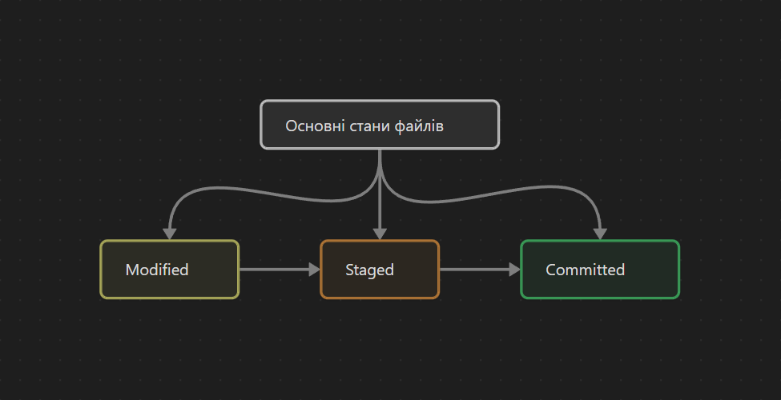

</details>

<details>
<summary>Що робить звичайну папку локальним репозиторієм?</summary>

- папка .git

</details>

<details>
<summary>Яка команда ініціалізує репозиторій?</summary>

- git init
  - після цієї команди з'являється папка .git і наша папка стала репозиторієм

</details>

---

<h3 id="git-config">Git — налаштування</h3>

<details>
<summary>Як переконатися, що Git встановлено (яка команда)?</summary>

- git --version

</details>

<details>
<summary>Яка команда дозволяє змінити налаштування (конфігурацію) Git?</summary>

- git config

</details>

<details>
<summary>Який прапорець дозволяє встановити зміни конфігурації для всіх репозиторіїв (теперішніх і майбутніх)?</summary>

- --global

</details>

<details>
<summary>Як встановити ім'я користувача у конфігурації?</summary>

- git config --global user.name `"your_name"`

</details>

<details>
<summary>Як встановити пошту (email) користувача у конфігурації?</summary>

- git config --global user.email `"your_email"`

</details>

<details>
<summary>Навіщо потрібно встановлювати ці налаштування?</summary>

- щоб git міг відслідковувати, хто автор змін

</details>

<details>
<summary>Яка команда перелік всіх налаштувань конфігурації?</summary>

- git config --list

</details>

<details>
<summary>Яка команда дозволяє вивести всі папки, в тому числі приховані (трекінгові)?</summary>

- ls -a

</details>

<details>
<summary>Яка команда дозволяє перевірити статус статуси файлів?</summary>

- git status

</details>

<details>
<summary>Яка команда дозволяє отримати довідку?</summary>

- git --help
- git `your_command` --help (довідка для конкретної команди)

</details>

---

<h3 id="git-main-theory">Git — теорія, основні концепції</h3>

<details>
<summary>Які три основні концепції git?</summary>

- коміти
- збереження усіх версій файлів
- гілки

</details>

<details>
<summary>Що таке коміт?</summary>

- збереження файлу (його версії)
- інформація про те:
  - хто зберіг
  - коли зберіг
  - що саме було зроблено
- можливість повернутися до попередніх версій файлів

</details>

<details>
<summary>Як зберігаються в комітах файли, в який не було жодних змін?</summary>

- зберігається **посилання** на вихідний файл

</details>

<details>
<summary>Який порядок локального збереження версій файлів?</summary>

- git add (staging area)
- git commit (committed area)

</details>

<details>
<summary>Локальне збереження файлів (схема)</summary>

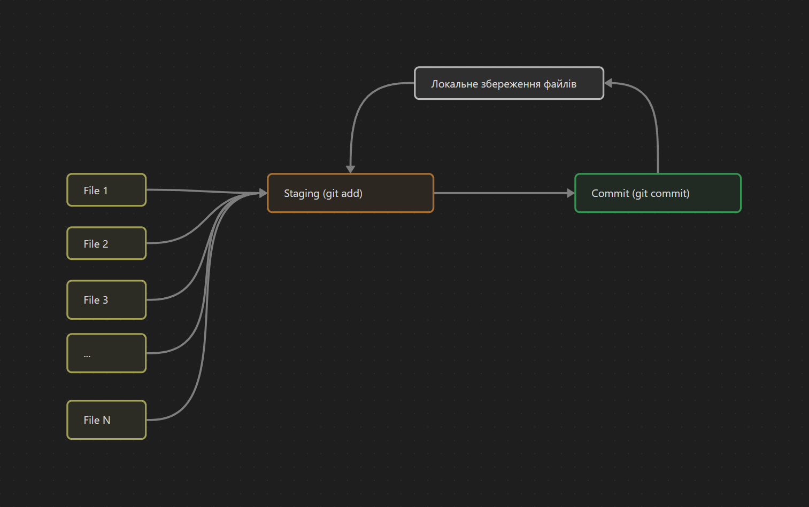

</details>

<details>
<summary>Які шляхи вказання шляху до потрібної директорії (команда і два варіанти відображення шляху)?</summary>

- команда — **cd**
- відображення шляху:
  - перетягти папку у вікно git bash (і шлях відобразиться, треба тільки cd на
    початку дописати)
  - написати повністю шлях самостійно

</details>

<details>
<summary>Які каталоги git не відстежує?</summary>

- в яких немає файлів, або файлів, які ігноруються через .gitignore

</details>

---

<h3 id="git-main-commands">Git — основні команди</h3>

[Конспект](https://github.com/NickTimosh/git_course/blob/main/notebooks/5.%20git%20-%20%D0%91%D0%B0%D0%B7%D0%BE%D0%B2%D1%96%20%D0%9A%D0%BE%D0%BC%D0%B0%D0%BD%D0%B4%D0%B8.md)

<h4>Додавання коду і коміти</h4>

<details>
<summary>Як додати усі файли однією командою у staging area?</summary>

- git add .

</details>

<details>
<summary>Як додати один файл у staging area?</summary>

- git add `file_name`

</details>

<details>
<summary>Як додати коротке повідомлення до коміту?</summary>

- git commit -m `"your_comment"`
- вказується коротко, які зміни зроблено

</details>

<details>
<summary>Внесення комітів через Wim (схема)</summary>

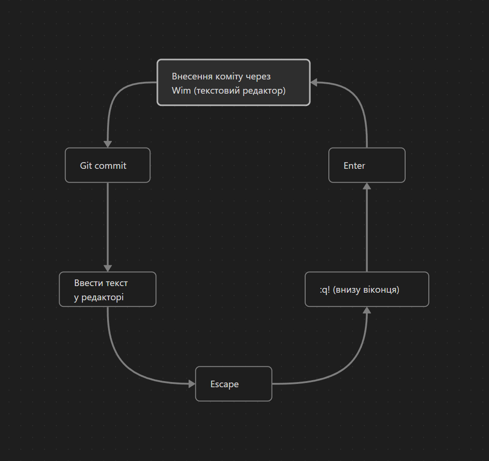

</details>

<details>
<summary>Внесення комітів через nano (схема)</summary>

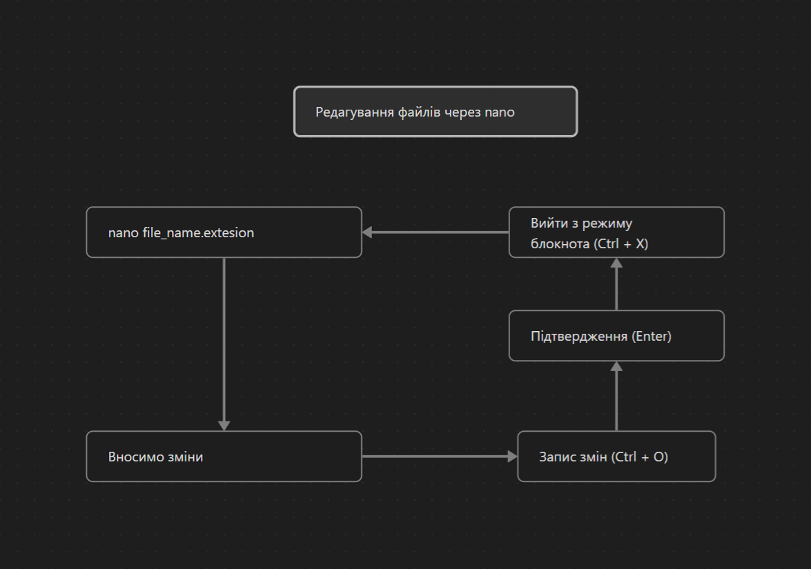

</details>

<details>
<summary>Внесення комітів через notepad (схема)</summary>

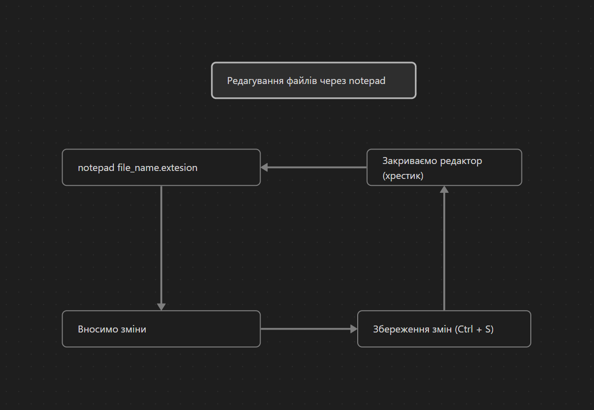

</details>

<details>
<summary>Як змінити текстовий редактор і встановити його основним (команда)?</summary>

- git config --global core.editor `"your_editor"

</details>

<h4>Історія комітів</h4>

<details>
<summary>Яка команда виводить перелік всіх комітів?</summary>

- git log

</details>

<details>
<summary>Який прапорець дозволяє вивести історію у більш компактному вигляді?</summary>

- --oneline
- повний варіант команди: git log --oneline

</details>

<details>
<summary>Яка команда (з прапорцем) дозволяє подивитися зміни комітів?</summary>

- git log -p

</details>

<details>
<summary>Як вийти з інтерактивного режиму (яка клавіша)?</summary>

- q (маленька)

</details>

<details>
<summary>Яка команда дозволяє подивитись відмінності  у файлах (і всього репозиторію)?</summary>

- git diff (difference)

</details>

---

<h3 id="git-extensions-basics">Git — розширення основ</h3>

[Конспект](https://github.com/NickTimosh/git_course/blob/main/notebooks/6.%20git%20-%20%D0%A0%D0%BE%D0%B7%D1%88%D0%B8%D1%80%D0%B5%D0%BD%D0%BD%D1%8F%20%D0%9E%D1%81%D0%BD%D0%BE%D0%B2.md)

<details>
<summary>Яка загальноприйнята практика формулювання повідомлень для комітів?</summary>

- наказова (імперативна) форма
  - (add, write, remove, delete, change, fix etc.)

</details>

<details>
<summary>Як додати тіло коміту, щоб детальніше описати зміни (послідовність кроків)?</summary>

- не закривати лапки
- клікнути enter
- перейти на новий рядок
- продовжити писати
- закрити лапки
- enter (для відправки коміту)

</details>

<details>
<summary>Як додати зміни так, щоб вони були частиною попереднього коміту, а не новоствореним комітом?</summary>

- git add .
- git commit --amend --no-edit (замість повідомлення)
- enter

</details>

<details>
<summary>Різниця у кроках між створення нового коміти і зміною існуючого (схема)</summary>

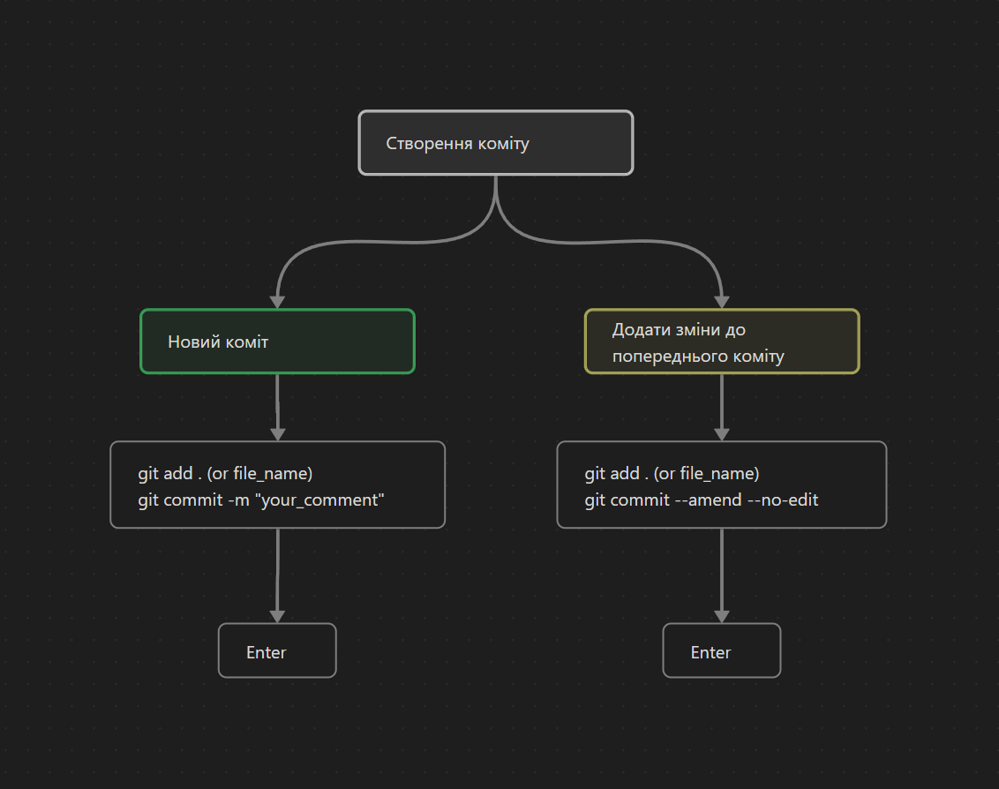

</details>

<details>
<summary>Як накопичувати зміни з різних файлів для одного коміту?</summary>

- внести зміни в різні файли та/або створити нові файли
- git add . (додаємо всі файли)
- git commit -m `"your_commit"`

</details>

<details>
<summary>Як додати кілька файлів (не всі) за один раз до staging area?</summary>

- git add `<file_1> <file_3> <file_5>`

</details>

<details>
<summary>Як побачити різницю у файлах, що вже додані до staging area?</summary>

- git diff --chached

</details>

<details>
<summary>Як повернути файли зі staging area до working area?</summary>

- **після** git add але **до** git commit
  - git restore --staged <file_name> or path to file

</details>

<details>
<summary>Як подивитися, який саме невідстежуваний файл користувач планує видалити (який прапорець)?</summary>

- -n
- повна команда: git clean -n

</details>

<details>
<summary>Яка команда дозволяє видалити невідстежувані файли з git (з прапорцем)?</summary>

- git clean -f

</details>

<details>
<summary>Яка команда дозволяє видалити невідстежувані файли і каталоги з git (з прапорцем)?</summary>

- git clean -fd
  - **ця команда незворотна**

</details>

<details>
<summary>Яка команда дозволяє видалити відстежувані файли з індексу та робочого каталогу?</summary>

- git rm `<file_name>` (remove)

</details>

<details>
<summary>Яка команда дозволяє видалити відстежувані файли тільки з індексу, залишивши його у робочому каталозі (з прапорцем)?</summary>

- git rm --cached `<file_name>`

</details>

---

<h3 id="git-recovery-version">Git — вступ до відновлення версій</h3>

[Конспект](https://github.com/NickTimosh/git_course/blob/main/notebooks/7.%20git%20-%20%D0%A0%D0%BE%D0%B1%D0%BE%D1%82%D0%B0%20%D0%B7%20%D0%9A%D0%BE%D0%BC%D1%96%D1%82%D0%B0%D0%BC%D0%B8.md)

<details>
<summary>Що зберігається в комітах?</summary>

- зміни, що були зроблені у файлах

</details>

<details>
<summary>Що має унікальне кожна нова версія файлів?</summary>

- "#" — хеш-код (як id)
  - є унікальним для кожної версії файлу

</details>

<details>
<summary>Основні area (схема)</summary>

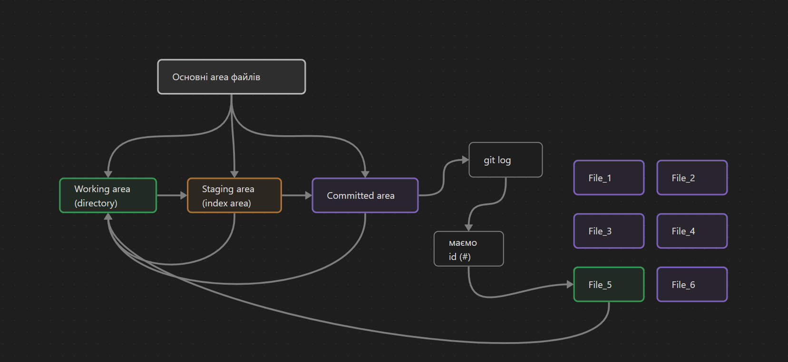

</details>

<details>
<summary>Яка команда дозволяє повернути закомічений файл (наприклад, після його видалення)?</summary>

- git restore `file_name`
  - за замовчування звернення до останньої закоміченої версії файлу

</details>

<details>
<summary>Яка команда дозволяє дізнатися, що було змінено в тому чи іншому коміті (по id)?</summary>

- git show `commit_id`

</details>

<details>
<summary>Яка команда дозволяє повернутися до конкретної версії файлу (а не тільки останньої, по id)?</summary>

- git restore --source=`commit_id` `file_name`

</details>

<details>
<summary>Яка команда дозволяє відмінити зміни, які вже були додані до staging area?</summary>

- git restore --staged `file_name`

</details>

<details>
<summary>Яка команда дозволяє повернутися до попередньої (та/або конкретної версії всього проєкту)?</summary>

- git reset `прапорець` `HEAD або ID`
- `HEAD` — останній коміт
- `ID` — конкретний коміт з переліку попередніх

</details>

<details>
<summary>Які прапорці має ця команда і чим вони відрізняються?</summary>

- --hard — перезапише повністю до поточної версії, до якої ми звернемося (через
  id) і повністю видаляє всі зміни

- --soft — дозволяє зберегти внесені зміни (у staging)

- --mixed — **використовується за замовчуванням**

  - всі зміни, які були додані до staging area, будуть прибрані назад у робочу
    директорію
  - тобто файли, які були в staging, знову стають "modified", але не видаляються

- повні команди:
  - git reset --hard `ID`
  - git reset --soft `ID`

</details>

---

<h3 id="git-branches">Git — вступ в git branch</h3>

[Конспект](<https://github.com/NickTimosh/git_course/blob/main/notebooks/8.%20git%20-%20Branches%20(%D0%B3%D1%96%D0%BB%D0%BA%D0%B8).md>)

<details>
<summary>Яка основна гілка проєкту?</summary>

- main (master) — різна назва, але значить одне й те саме

</details>

<details>
<summary>Принцип роботи гілок (схема)</summary>

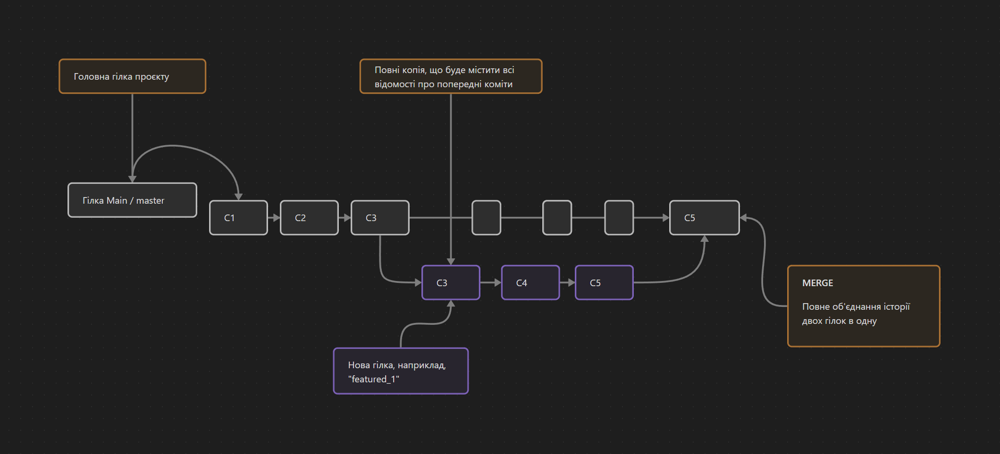

</details>

<h4>HEAD</h4>

<details>
<summary>Що таке HEAD?</summary>

- вказівник того, де ми знаходимось
  - в якій гілці
  - в якому коміті
- за замовчуванням знаходимося в останньому коміті
- кожна окрема гілка має свій HEAD

</details>

<details>
<summary>Що означає "detached HEAD"?</summary>

- коли `HEAD` не вказує на останній коміт гілки, а вказує на конкретний коміт
  або тег

</details>

<details>
<summary>За допомогою якої команди HEAD переходить у стан detached HEAD?</summary>

- git checkout `commit_hash`
- у цьому випадку `HEAD` вказує на той коміт, а не на гілку

</details>

<details>
<summary>Що дає detached HEAD?</summary>

- У стані detached HEAD можна переглядати або тестувати код на певному коміті,
  але будь-які нові коміти, які будуть зроблені, не будуть пов'язані з жодною
  гілкою
- для збереження коміту, що був зроблений у цьому стані, потрібно створити нову
  гілку, щоб не втратити зміни

</details>

<details>
<summary>Як вийти зі стану "detached HEAD"?</summary>

- використати команду `git checkout <branch-name>`, де `<branch-name>` — це
  назва гілки, на якій ви хотіли б продовжити працювати

</details>

<details>
<summary>Принцип роботи HEAD (схема)</summary>

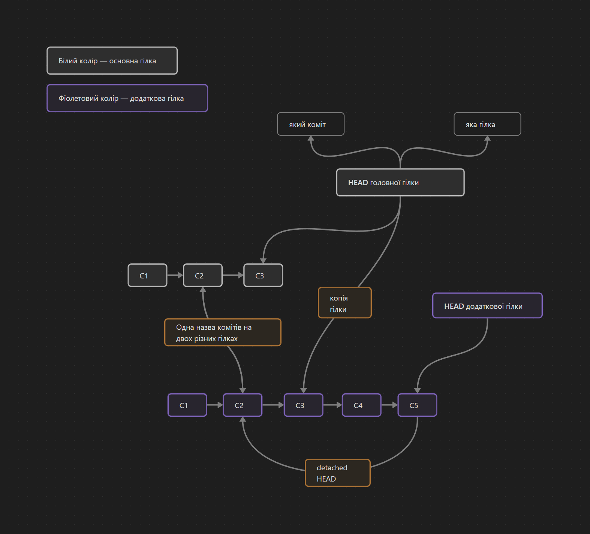

</details>

<h4>Конфлікти</h4>

<details>
<summary>Що таке конфлікти в git?</summary>

- ситуація, коли на одних і тих самих рядках, в одних і тим самих файлах вказані
  різні дані

</details>

<details>
<summary>Що значить "вирішити конфлікт"?</summary>

- конкретне вказання git, які саме зміни мають бути внесені

</details>

<h4>Merge vs Rebase</h4>

<details>
<summary>Що значить merge?</summary>

- впровадити зміни до основої гілки (об'єднати всі додаткові гілки в main)

</details>

<details>
<summary>Яка є альтернативна merge?</summary>

- rebase

</details>

<details>
<summary>Що дозволяє робити ця альтернатива?</summary>

- інтегрувати зміни **після** останньої актуальної версії в main гілці

</details>

<details>
<summary>Які складнощі пов'язані з цим способом?</summary>

- перезапис id деяких комітів, що може викликати певні складнощі, якщо виникне
  потреба відновити якісь попереднії версії

</details>

<details>
<summary>Різниця між merge і rebase (схема)</summary>

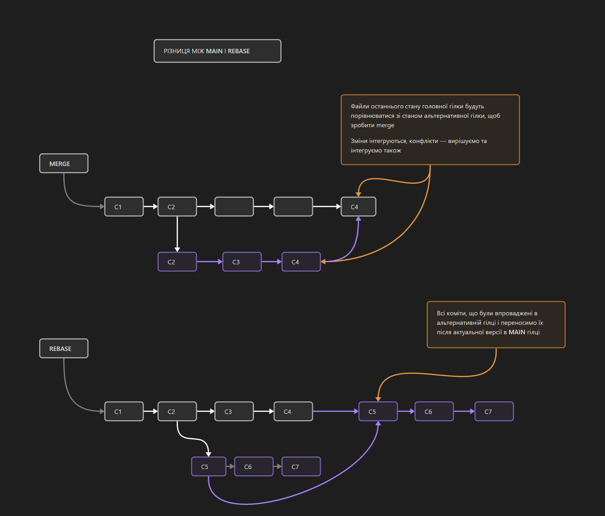

</details>

<h4>Гілки</h4>

<details>
<summary>Яка команда виведе список всіх гілок?</summary>

- якщо потрібно побачити тільки локальні гілки
  - git branch
- якщо потрібно побачити віддалені гілки
  - git branch -r

</details>

<details>
<summary>Яка команда дозволяє створити нову гілку?</summary>

- git branch `branch_name`

</details>

<details>
<summary>Яка команда дозволяє перемикатися між гілками?</summary>

- git checkout `branch_name`

</details>

<details>
<summary>Яка команда дозволяє створити і перемкнутися на гілку (одна команда — дві дії)?</summary>

- git checkout -b `branch_name`
  - -b — від слова branch

</details>

<details>
<summary>Яка є альтернативна команда для зміни гілки?</summary>

- git switch `branch_name`

</details>

<details>
<summary>Яка вона дозволяє за один крок створити гілку і одразу перемкнутися на неї (синтаксис команди)?</summary>

- git switch -b `branch_name`

</details>

<details>
<summary>Яка різниця між цими двома варіантами команд?</summary>

- git switch:
  - більш проста у розуміння і використанні
  - використовується спеціально для перемикання (та/або для створення і
    перемикання) між гілками
- git checkout:
  - більш універсальна
  - використовується для:
    - перемикання (та/або для створення і перемикання) між гілками
    - зміни гілок
    - відновлення файлів (скасування змін)
    - перемикання між комітами

</details>

<details>
<summary>В якій гілці ми маємо знаходитися перед тим, як зробити об'єднання гілок?</summary>

- в тій, в яку хочемо інтегрувати зміни (в цільовій)

</details>

<details>
<summary>Яка команда дозволяє об'єднати гілки?</summary>

- git merge `branch_name`

</details>

<details>
<summary>Назву якої гілки ми маємо писати у команді об'єднання?</summary>

- назву гілки, **яку об'єднуємо** з цільовою гілкою (тобто назву альтернативної,
  додаткової гілки)

</details>

<details>
<summary>Яка команда дозволяє тільки передати зміни, але не об'єднувати гілки?</summary>

- git fetch

</details>

<details>
<summary>Яка команда (з прапорцем) дозволяє видалити гілку?</summary>

- git branch -d `branch_name`
- git branch -D `branch_name`

</details>

<details>
<summary>Яка різниця між цими двома прапорцями?</summary>

- **-d** (soft delete) — не дозволить видалити гілку, яка ще не була передана до
  main (яка ще не інтегрована)
- **-D** (hard delete) — видалить гілку незалежно від того, чи вона вже
  інтегрована у main чи ще ні (безумовне видалення гілки)

</details>

---

# GitHub 

<h3 id="github-concept">GitHub — основні концепції</h3>

<h4>Віддалений репозиторій</h4>

<details>
<summary>Які бувають git-сховища?</summary>

- GitHub
- GitLab
- Bitbucket, Azure DevOps, SourceForge — також популярні віддалені репозиторії

</details>

<details>
<summary>Яке типове ім'я git?</summary>

- origin - стандартна назва для віддаленого репозиторію, але її можна змінювати

</details>

<h4>Клонування (Clone)</h4>

<details>
<summary>Що передбачає концепція клонування?</summary>

- створення локальної копії віддаленого репозиторію на комп'ютері

</details>

<h4>SSH-ключ (SSH-key)</h4>

<details>
<summary>Що передбачає концепція такого ключа?</summary>

- спосіб безпечного підключення по GitHub без введення пароля
  - SSH-ключ складається з публічного та приватного ключа. Публічний ключ
    додається до GitHub, а приватний зберігається локально

</details>

<h4>Пуш (Push)</h4>

<details>
<summary>Що передбачає концепція push?</summary>

- надсилання змін у віддалений репозиторій

</details>

<details>
<summary>Яка команда?</summary>

- git push

</details>

<h4>Пул (pull)</h4>

<details>
<summary>Що передбачає ця концепція?</summary>

- завантаження змін з віддаленого репозиторію

</details>

<details>
<summary>Яка команда?</summary>

- git pull

</details>

<h4>Пул-реквест (Pull Request, PR)</h4>

<details>
<summary>Що передбачає ця концепція?</summary>

- запит на злиття змін із однієї гілки в іншу
- часто використовується для перевірки коду

</details>

<details>
<summary>Як називається перевірка коду іншим розробником?</summary>

- code review

</details>

<h4>Форк (Fork)</h4>

<details>
<summary>Що передбачає ця концепція?</summary>

- копіювання репозиторію в акаунт користувача, що дозволяє експериментувати з
  кодом, не змінюючи оригінал

</details>

<h4>README.md</h4>

<details>
<summary>Що це за файл?</summary>

- файл документації, що зазвичай містить опис проєкту, інструкції з використання
  та іншу корисну інформацію

</details>

<details>
<summary>Що означає розширення **.md**</summary>

- формат markdown
- система форматування тексту

</details>

<h4>Issues (Завдання)</h4>

<details>
<summary>Що передбачає ця концепція?</summary>

- систему відстеження помилок, запитів на нові функції та обговорень у
  репозиторії

</details>

---

<h3 id="github-first-repo">GitHub — перший репозиторій</h3>

<details>
<summary>Яка має бути назва репозиторію?</summary>

- унікальною в межах репозиторію

</details>

<details>
<summary>Які бувають типи репозиторіїв?</summary>

- публічні
- приватні

</details>

<details>
<summary>Що таке ліцензія?</summary>

- документ, у якому прописано, що можна, а що заборонено робити з репозиторієм
  (чи можна завантажувати код, перевикористовувати його у власних проєктах і тд)
- опис можливостей взаємодії з репозиторієм

</details>

<details>
<summary>Про що говорить ліцензія MIT?</summary>

- про те, що код і файли з репозиторію можна використовувати як завгодно без
  обмежень, але **обов'язково потрібно вказати авторство власника репозиторію, з
  якого беруться дані**

</details>

<details>
<summary>Як можна додати файли у репозиторій?</summary>

- створити прямо на платформі у github
- завантажити з комп'ютера через командний рядок

</details>

---

<h3 id="github-gitignore">GitHub — файл .gitignore</h3>

<details>
<summary>Що таке .gitignore?</summary>

- файл, який використовується для того, щоб ігнорувати певні файли та папки в
  git. Файли і теки, додані в .gitignore не будуть додватись у коміти та
  потрапляти у репозиторій

</details>

<details>
<summary>Яку папку ні в якому разі не можна додавати у репозиторій?</summary>

- node_module — тека, яка містить всі залежності, встановлені у проєкті

</details>

<details>
<summary>Якою командою можна завантажити цю папку, не завантажуючи її у репозиторій?</summary>

- npm install

</details>

---

<h3 id="github-watch-fork-stars">GitHub — watch, fork & stars</h3>

<details>
<summary>Що дає змогу робити кнопка "Watch" у репозиторії?</summary>

- слідкувати за змінами репозиторію

</details>

<details>
<summary>Що дає змогу зробити кнопка "Fork"?</summary>

- зробити повну копію репозиторію

</details>

<details>
<summary>Як використовується зірочка в репозиторіях?</summary>

- як елементи рейтингу

</details>

---

<h3 id="github-fork">GitHub — копіювання репозиторію (Fork)</h3>

<details>
<summary>Чи впливають зміни, внесені у скопійований репозиторій на оригінал?</summary>

- ніяким чином, це два окремі репозиторії

</details>

<details>
<summary>У якій вкладці можна подивитися, хто зробив копію репозиторію?</summary>

- insights —> forks

</details>

<details>
<summary>Як можна змінити видимість репозиторію (яка вкладка і шлях)?</summary>

- settings —> general —> danger zone —> change repository visibility

</details>

---

<h3 id="github-pr">GitHub — створення Pull Requests (PR)</h3>

<details>
<summary>Що таке pull request?</summary>

- запит на об'єднання змін, які розробник вніс в код, з основною гілкою проєкту

</details>

<details>
<summary>Де розробник може вносити зміни віддалено без шкоди основному репозиторію (два варіанти)?</summary>

- створити окрему гілку (git branch -b `branch_name`)
- повністю скопіювати репозиторій (fork)

</details>

<details>
<summary>Яка вкладка відповідає за створення pull request?</summary>

- однойменна "Pull request"

</details>

<details>
<summary>Який статус повідомляє про те, що об'єднання можливе?</summary>

- able to merge

</details>

<details>
<summary>Головна анатомія створення реквесту (схема)</summary>

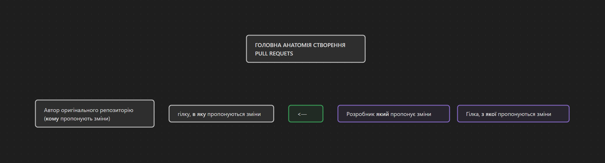

</details>

---

<h3 id="github-issues">GitHub — створення Issues (задач)</h3>

<details>
<summary>Яка вкладка відповідає за створення завдання?</summary>

- однойменна "Issues"

</details>

<details>
<summary>Як можна створити задачу?</summary>

- натиснути на кнопку "New issue"
- ввести title — лаконічно пояснити, яка проблема виникла
- написати description (за потреби додати якісь додаткові матеріали) —
  запропонувати кілька рішень
- натиснути кнопку "create"

</details>

---

<h3 id="github-workflow">GitHub — огляд типового workflow</h3>

<details>
<summary>Огляд workflow роботи git-github (схема)</summary>

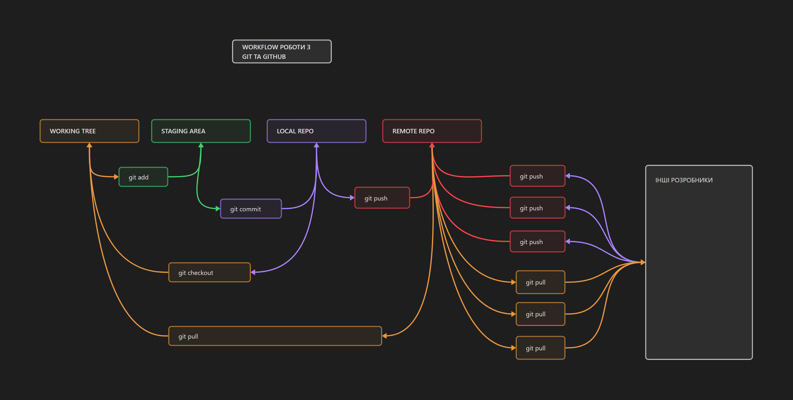

</details>

<details>
<summary>Які основні кроки?</summary>

1. **connection** — утворення зв'язку між git & github
   1. ssh-key
2. **sync** — синхронізація того, що є на комп'ютері і того, що є на github
   1. **push** local to remote repo або
   2. **clone** remote to local repo
3. **pull** — завантажити собі останню актуальну версію проєкту (оновлення
   локального репо)
4. **branch** — створюємо нову гілку
5. **commit** — передаємо зміни з гілки до локального репо
6. **push** — відправляємо всю гілку зі змінами до віддаленого репо
7. **pull request** — інформація про зміни, які ми плануємо передати до main
   1. code review
   2. merge
8. повторюємо цикл з пункту три

</details>

---

<h3 id="github-ssh-key">GitHub — SSH-ключ</h3>

<details>
<summary>Що таке ssh-ключ?</summary>

- файл, який має зберігати приватний ключ на комп'ютері та одночасно публічний
  ключ на github

</details>

<details>
<summary>У якій вкладці ці ключі зберігаються на github?</summary>

- profile settings —> SSH and GPG keys

</details>

<details>
<summary>Яка послідовність створення і збереження?</summary>

1. створити файл на машині, де буде зберігатися ключ
2. додати його на github

</details>

<details>
<summary>Скільки разів має створюватися цей ключ?</summary>

- один раз на одну машину

</details>

[Мега важливий конспект по створенню і збереженню ssh ключа](https://github.com/NickTimosh/git_course/blob/main/notebooks/9.%20Github%20-%20SSH%20keys.md)

---

<h3 id="github-push-local-repo">GitHub — push локального репозиторію</h3>

<details>
<summary>Яка послідовність ініціалізацї, комітів та додавання файлів до локального репо (крок — команда)?</summary>

1. ініціалізація репозиторію
   1. git init
2. додати файли до staging area
   1. git add .
3. зробити коміт
   1. git commit -m `"Initial commit"`
4. перевірка статусу (за потреби)
   1. git status

</details>

<details>
<summary>Яка команда дозволяє відправити зміни на github?</summary>

- git remote add origin `repo_link` (https or ssh)

</details>

<details>
<summary>Що означає "origin"?</summary>

- використовується як псевдонім до посилання

</details>

<details>
<summary>Звідки можна взяти посилання на repo?</summary>

- з github
  - при створення порожнього репозиторію це вікно відкривається по дефолту з
    детальним описом, як віддалений репозиторій підв'язати до локального

</details>

<details>
<summary>Яка команда дозволяє відправити весь код з локальної машини на віддалений репозиторій після об'єднання цих репозиторіїв?</summary>

- git push -u origin main
- -u — від слова "upstream"

</details>

<details>
<summary>За що відповідає upstream?</summary>

- повідомляє github з якої гілки брати зміни та/або в яку гілку зміни
  завантажувати
  - Upstream гілка — це віддалена гілка, до якої підключено локальну гілку для
    відправки та отримання змін

</details>

<details>
<summary>Яка команда дозволяє перейменувати головну гілку (з master на main)?</summary>

- git branch -M main

</details>

---

<h3 id="github-brach-and-pull">GitHub — гілки та pull request</h3>

<details>
<summary>Яка команда дозволяє відправити на віддалений репозиторій гілку, яка була створено локально?</summary>

- git push --set -upstream origin `branch_name`
  - зазвичай git одразу пропонує цю команду за замовчування після команди push,
    тому залишається тільки скопіювати її і вставити в термінал

</details>

<details>
<summary>Що робить --set upstream?</summary>

- встановлює гілку на віддаленому репозиторії origin
  - --set-upstream встановлює зв'язок між локальною і віддаленою гілкою для
    автоматичної синхронізації

</details>

<details>
<summary>Анатомія гілок при pull request (схема)</summary>

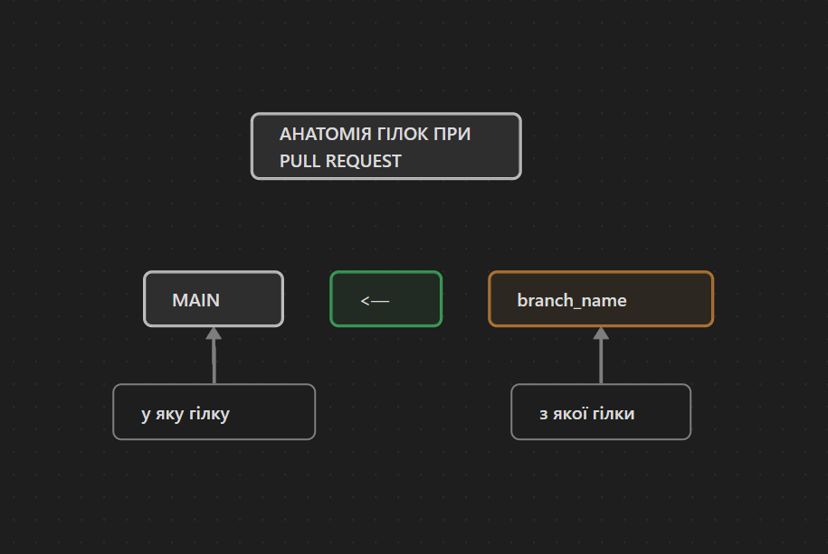

</details>

---

<h3 id="github-clone-repo">GitHub — клонування репозиторію</h3>

<details>
<summary>За допомогою якої команди можна скопіювати репозиторій собі локально?</summary>

- git clone `repo_link` (https or ssh)

</details>

<details>
<summary>Яка різниця між використання https та ssh посилання?</summary>

- https вимагає явної авторизації
- з ssh ключем проводиться неявна авторизація (немає потреби кожен раз вводити
  логін і пароль для підтвердження)

</details>

<details>
<summary>Яка команда дозволяє відобразити які локальні гілки пов'язані з віддаленими гілками?</summary>

- git branch -vv
- також ця команда показує інформацію про останні коміти в цих гілках

</details>
